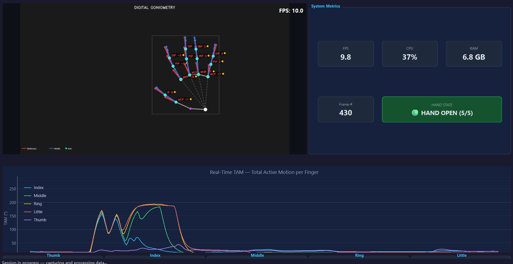

# Avaliação Cinemática da Mão Baseada em Visão Computacional

<div align="center">
  
</div>

> **Avaliação cinemática de dedos sem marcadores em tempo real com emissão automatizada de relatórios clínicos — webcam RGB comum, sem necessidade de hardware especializado.**
> 
[](https://www.python.org/)
[](https://www.riverbankcomputing.com/software/pyqt/)
[](https://mediapipe.dev/)
[](https://opencv.org/)
[](LICENSE)

---

## Sumário

- [Sobre o Projeto](#sobre-o-projeto)
- [Funcionalidades](#funcionalidades)
- [Arquitetura do Sistema](#arquitetura-do-sistema)
- [Tecnologias Utilizadas](#tecnologias-utilizadas)
- [Pré-requisitos](#pré-requisitos)
- [Instalação](#instalação)
- [Como Executar](#como-executar)
- [Estrutura do Projeto](#estrutura-do-projeto)
- [Configuração](#configuração)
- [Geração de Relatórios](#geração-de-relatórios)
- [Logs do Sistema](#logs-do-sistema)
- [Contribuição](#contribuição)

---

## Sobre o Projeto

O **Computer Vision-Based Hand Kinematic Assessment** é uma aplicação desktop clínica desenvolvida para profissionais da saúde — fisioterapeutas, terapeutas ocupacionais e médicos — que necessitam medir com precisão os ângulos de flexão/extensão das articulações dos dedos da mão em tempo real.

O sistema utiliza a câmera do computador, sem a necessidade de nenhum equipamento físico adicional (como o goniômetro manual tradicional), e detecta automaticamente os marcos anatômicos da mão para calcular os ângulos articulares de **MCP**, **PIP**, **DIP** e, para o polegar, **IP** e **ABD**. Além disso, calcula automaticamente o Movimento Ativo Total (**TAM**) com classificação funcional baseada no protocolo **ASSH**.

### Contexto Clínico

A goniometria é o método padrão-ouro para avaliação da amplitude de movimento articular (ROM). No contexto de reabilitação, medições frequentes e objetivas são essenciais para acompanhar a evolução do paciente. Este sistema digitaliza e acelera esse processo, eliminando o erro operador-dependente do goniômetro físico.

---

## Funcionalidades

- **Captura de vídeo em tempo real** via webcam com resolução HD (1280x720)
- **Detecção automática de marcos anatômicos** das 21 articulações da mão via MediaPipe
- **Cálculo goniométrico em tempo real** para os 5 dedos (Indicador, Médio, Anelar, Mínimo e Polegar)
- **Cálculo de TAM** e amplitude articular com classificação funcional no padrão ASSH
- **Gráficos dinâmicos** com histórico de ângulos por articulação (PyQtGraph)
- **Painel de métricas clínicas** com amplitude mínima, máxima e média da sessão
- **Pipeline duplo de suavização** — Média Móvel Exponencial (EMA) + Filtro de Kalman — para eliminar oscilações (jitter) sem introduzir latência
- **Gravação da sessão em CSV** com registro temporal (timestamp) e valores por articulação
- **Geração de relatório em PDF** com resumo clínico da sessão
- **Interface em Modo Escuro (Dark Mode)** profissional e responsiva
- **Painel de logs em tempo real** integrado à interface
- **Configuração centralizada** — todos os parâmetros em um único arquivo `config.py`

---

## Arquitetura do Sistema

O sistema foi construído no padrão **Produtor-Consumidor com Workers Qt**, garantindo que captura de vídeo, processamento de IA e atualizações de UI sejam completamente desacoplados e não bloqueiem a interface gráfica através de uma API interna de sinais thread-safe.

```
+------------------------------------------------------------------+
|                        app_pyqt.py                               |
|                  (Ponto de Entrada + Logging)                    |
+-------------------------+----------------------------------------+
                          |
                          v
+------------------------------------------------------------------+
|                    ui/main_window.py                             |
|              (Orquestrador Principal da UI)                      |
|                                                                  |
|  +--------------+  +--------------+  +---------------------+     |
|  | video_widget |  | plot_widget  |  | finger_card_widget  |     |
|  | (Visualização)  |  (Gráficos)  |  | (Cartões por Dedo)  |     |
|  +--------------+  +--------------+  +---------------------+     |
|  +--------------+  +--------------+  +---------------------+     |
|  |session_header|  |metrics_widget|  |    log_widget       |     |
|  | (Cabeçalho)  |  |  (Métricas)  |  | (Log em tempo real) |     |
|  +--------------+  +--------------+  +---------------------+     |
+---------------------------+--------------------------------------+
                            | Sinais Qt (thread-safe)
             +--------------+--------------+
             v                             v
+--------------------+         +----------------------+
|   workers/         |  Queue  |   workers/           |
|   CameraWorker     +-------->|   ProcessingWorker   |
| (Thread da Câmera) |  (=1)   | (Thread de IA/Cálc.) |
+--------------------+         +----------+-----------+
                                          |
                              +-----+-----+------+
                              v     v            v
                         goniometry  smoothing  clinical_
                            .py        .py      classification.py
```

**Princípios de design:**
- **Thread Safety**: Toda a comunicação entre threads utiliza a API de sinais/slots do Qt — nunca acesso direto à interface a partir de threads secundárias.
- **Tamanho da Fila = 1 (Queue Size = 1)**: A fila entre CameraWorker e ProcessingWorker possui tamanho máximo 1, garantindo que o processador sempre receba o quadro mais recente (sem acúmulo de latência).
- **Configuração centralizada**: Sem "números mágicos" espalhados pelo código — tudo centralizado em `config.py`.

---

## Tecnologias Utilizadas

| Categoria | Tecnologia | Versão |
|-----------|-----------|--------|
| **Linguagem** | Python | 3.11+ |
| **Interface Gráfica** | PyQt6 | 6.6+ |
| **Gráficos em Tempo Real** | PyQtGraph | 0.13+ |
| **Visão Computacional** | MediaPipe | 0.10.11-0.10.17 |
| **Captura de Vídeo** | OpenCV (cv2) | 4.9+ |
| **Cálculos Matemáticos** | NumPy | 1.24-1.x |
| **Relatórios em PDF** | FPDF2 | 2.7+ |
| **Visualização de Dados** | Matplotlib | 3.7+ |
| **Monitoramento / Logs** | Logging (stdlib) | native |
| **Monitoramento de Recursos** | psutil | 5.9+ |

### Resumo Técnico

* **Linguagem**: Python 3.11+
* **Interface**: PyQt6
* **Visão Computacional**: MediaPipe & OpenCV
* **Cálculos Matemáticos**: NumPy
* **Relatórios**: FPDF2
* **Logs do Sistema**: Módulo nativo `logging`

---

## Pré-requisitos

- **Sistema Operacional**: Windows 10/11 (recomendado), Linux ou macOS
- **Python**: 3.10 ou 3.11 (obrigatório — limitação do MediaPipe)
- **Câmera**: Webcam integrada ou USB com resolução mínima de 720p
- **Memória RAM**: Mínimo de 4 GB (8 GB recomendado)
- **GPU**: Não necessária — o processamento é realizado na CPU

---

## Instalação

### 1. Clonar o repositório

```bash
git clone https://github.com/your-username/computer-vision-based-hand-kinematic-assessment.git
cd computer-vision-based-hand-kinematic-assessment
```

### 2. Criar e ativar um ambiente virtual

```bash
# Windows
python -m venv .venv
.venv\Scripts\activate

# Linux/macOS
python3 -m venv .venv
source .venv/bin/activate
```

### 3. Instalar as dependências

```bash
pip install -r requirements.txt
```

> **Atenção (Windows):** Caso ocorra um erro de SSL ao instalar o `aiortc`, execute:
> ```bash
> pip install aiortc==1.9.0
> ```

---

## Como Executar

### Interface Desktop (PyQt6) — Recomendada

```bash
python app_pyqt.py
```

---

## Estrutura do Projeto

```
computer-vision-based-hand-kinematic-assessment/
|
+-- app_pyqt.py                  # Ponto de entrada principal (PyQt6)
+-- config.py                    # Configuração centralizada (parâmetros globais)
+-- goniometry.py                # Motor de cálculo goniométrico (ângulos articulares)
+-- goniometry_overlay.py        # Renderização de sobreposição na imagem da câmera
+-- goniometry_csv.py            # Gravação dos dados da sessão em CSV
+-- session_report.py            # Geração de relatório clínico em PDF
+-- smoothing.py                 # Pipeline de suavização (EMA + Filtro de Kalman)
+-- clinical_classification.py   # Classificação clínica dos ângulos medidos
+-- dashboard_utils.py           # Utilitários de painel e cálculo
+-- themes.py                    # Tema visual Dark Mode (estilos Qt)
+-- requirements.txt             # Dependências do projeto
|
+-- ui/                          # Interface gráfica (widgets PyQt6)
|   +-- main_window.py           #   Janela principal (orquestrador)
|   +-- video_widget.py          #   Widget de visualização da câmera
|   +-- plot_widget.py           #   Widget de gráficos em tempo real
|   +-- finger_card_widget.py    #   Cartões individuais por dedo
|   +-- metrics_widget.py        #   Painel de métricas clínicas
|   +-- session_header.py        #   Cabeçalho da sessão
|   +-- log_widget.py            #   Painel de logs integrado
|
+-- workers/                     # Threads de processamento (Produtor-Consumidor)
|   +-- camera_worker.py         #   Thread de captura de vídeo (workers/camera_worker.py)
|   +-- processing_worker.py     #   Thread de processamento de IA + cálculos (workers/processing_worker.py)
|
+-- assets/                      # Recursos estáticos (ícones, imagens)
+-- logs/                        # Logs gerados pela aplicação
+-- tests/                       # Testes automatizados
```

---

## Configuração

Todos os parâmetros do sistema estão centralizados em [`config.py`](config.py). Não é necessário alterar nenhum outro arquivo para ajustar o comportamento do sistema.

### Principais parâmetros

| Parâmetro | Valor Padrão | Descrição |
|-----------|-------------|-----------|
| `CAMERA_INDEX` | `0` | Índice da câmera (0 = padrão) |
| `CAMERA_WIDTH` | `1280` | Largura de captura em pixels |
| `CAMERA_HEIGHT` | `720` | Altura de captura em pixels |
| `TARGET_FPS` | `30` | Taxa de quadros pretendida (FPS) |
| `EMA_ALPHA` | `0.30` | Fator de suavização EMA (0-1) |
| `KALMAN_Q` | `0.01` | Ruído de processo (Filtro de Kalman) |
| `KALMAN_R` | `0.10` | Ruído de medição (Filtro de Kalman) |
| `MP_DETECT_CONF` | `0.70` | Confiança mínima de detecção (MediaPipe) |
| `MP_TRACK_CONF` | `0.50` | Confiança mínima de rastreamento (MediaPipe) |
| `BUFFER_SIZE` | `500` | Pontos no histórico dos gráficos (~16s a 30 FPS) |
| `CSV_LOG_INTERVAL` | `3` | Frequência de gravação no CSV (a cada N quadros) |

### Alterar câmera

Caso o computador possua múltiplas câmeras, altere em `config.py`:

```python
CAMERA_INDEX: int = 1  # 0 = padrão, 1 = câmera externa, etc.
```

---

## Geração de Relatórios

Ao encerrar uma sessão de avaliação, o sistema gera automaticamente:

1. **Arquivo CSV** — contém os valores brutos de todos os ângulos articulares com registro temporal (timestamp), gravados a aproximadamente 10 amostras/segundo.
2. **Relatório em PDF** — resumo clínico da sessão com amplitude mínima, máxima e média por articulação, gerado via [`session_report.py`](session_report.py) com a biblioteca FPDF2.

Os arquivos são salvos na pasta raiz do projeto com o timestamp da sessão no nome do arquivo.

---

## Logs do Sistema

O sistema mantém dois níveis de log:

| Tipo | Localização | Conteúdo |
|------|------------|----------|
| **Log da Aplicação** | `logs/app.log` | Eventos do sistema, erros, inicialização |
| **Log da Sessão (CSV)** | Raiz do projeto | Dados clínicos (ângulos por quadro) |

O log da aplicação utiliza o módulo nativo `logging` do Python, configurado em [`app_pyqt.py`](app_pyqt.py) para registrar simultaneamente no **console** (terminal) e no **arquivo** `logs/app.log`.

Formato padrão das mensagens:

```
2026-06-23 14:35:12,123 | INFO     | ui.main_window | Session started
2026-06-23 14:35:45,891 | WARNING  | workers.camera | Frame dropped (queue full)
2026-06-23 14:36:02,045 | ERROR    | goniometry     | Insufficient landmarks
```

---

## Contribuição

Contribuições são bem-vindas. Para contribuir:

1. Faça um fork do projeto
2. Crie uma branch para sua feature: `git checkout -b feature/my-feature`
3. Faça o commit das suas alterações: `git commit -m "feat: add my feature"`
4. Envie o push para a branch: `git push origin feature/my-feature`
5. Abra um Pull Request

### Padrões de código

- Siga as convenções de nomenclatura existentes (`snake_case` para funções/variáveis, `UPPER_CASE` para constantes)
- Qualquer novo parâmetro numérico deve ser adicionado ao `config.py`, nunca inline no código
- Docstrings são obrigatórias para novas funções e classes
- Mantenha os testes em `/tests` atualizados

---

## Licença

Este projeto está licenciado sob a Licença MIT. Consulte o arquivo [LICENSE](LICENSE) para mais detalhes.

---

Desenvolvido para aplicação clínica em fisioterapia e terapia ocupacional.
