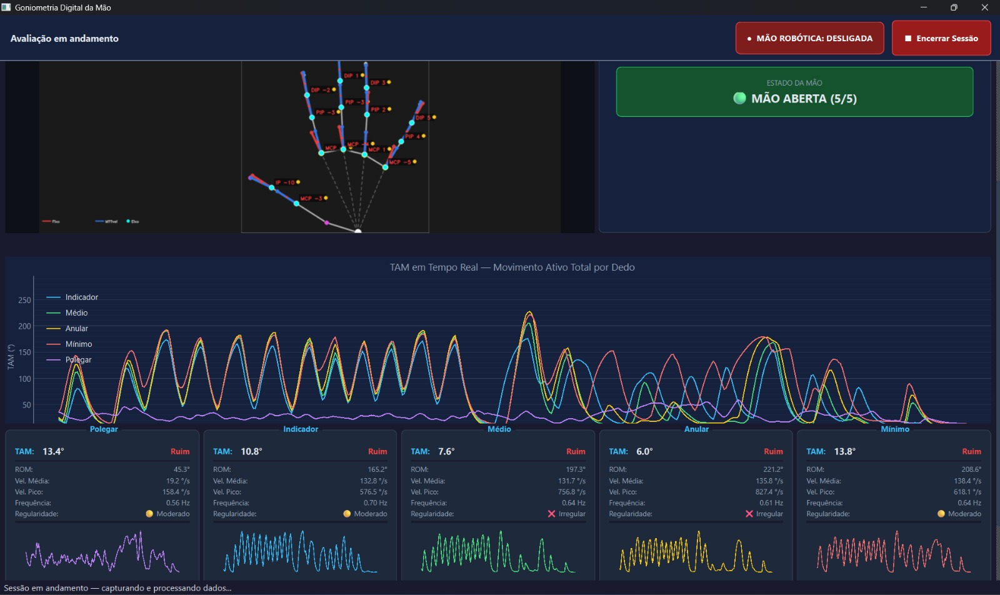
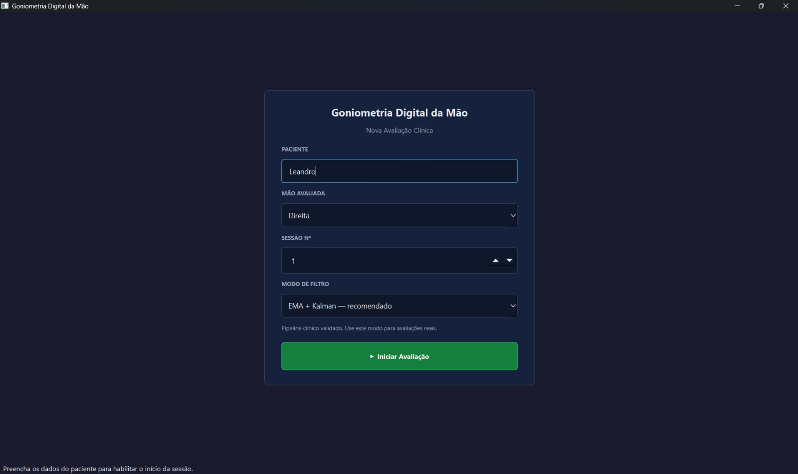
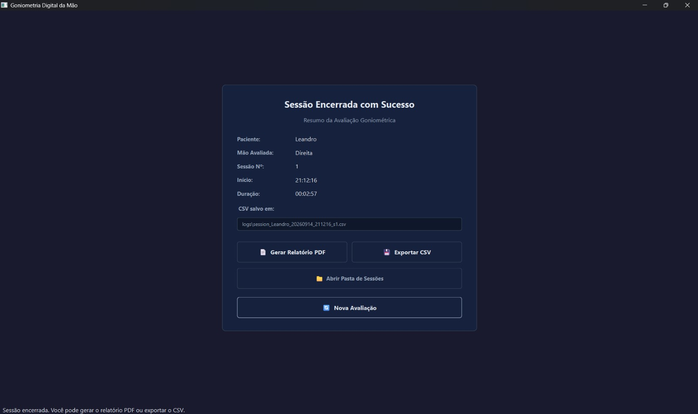

# Avaliação Cinemática da Mão Baseada em Visão Computacional

<div align="center">
  
</div>

> **Avaliação cinemática de dedos sem marcadores em tempo real com emissão automatizada de relatórios clínicos — webcam RGB comum, sem necessidade de hardware especializado.**
> 
[](https://www.python.org/)
[](https://www.riverbankcomputing.com/software/pyqt/)
[](https://mediapipe.dev/)
[](https://opencv.org/)
[](LICENSE)

---

## Sumário

- [Sobre o Projeto](#sobre-o-projeto)
- [Funcionalidades](#funcionalidades)
- [Fluxo Clínico e Telas](#fluxo-clínico-e-telas)
- [Arquitetura do Sistema](#arquitetura-do-sistema)
- [Tecnologias Utilizadas](#tecnologias-utilizadas)
- [Pré-requisitos](#pré-requisitos)
- [Instalação](#instalação)
- [Como Executar](#como-executar)
- [Estrutura do Projeto](#estrutura-do-projeto)
- [Configuração](#configuração)
- [Integração com Mão Robótica](#integração-com-mão-robótica)
- [Geração de Relatórios e Exportação](#geração-de-relatórios-e-exportação)
- [Logs e Dados da Sessão](#logs-e-dados-da-sessão)
- [Contribuição](#contribuição)
- [Licença](#licença)

---

## Sobre o Projeto

O **Computer Vision-Based Hand Kinematic Assessment** é uma aplicação desktop clínica desenvolvida para profissionais da saúde — fisioterapeutas, terapeutas ocupacionais e médicos — que necessitam medir com precisão os ângulos de flexão/extensão das articulações dos dedos da mão em tempo real.

O sistema utiliza a câmera do computador, sem a necessidade de nenhum equipamento físico adicional (como o goniômetro manual tradicional), e detecta automaticamente os marcos anatômicos da mão para calcular os ângulos articulares de **MCP**, **PIP**, **DIP** e, para o polegar, **IP** e **ABD**. Além disso, calcula automaticamente o Movimento Ativo Total (**TAM**) com classificação funcional baseada no protocolo **ASSH**.

### Contexto Clínico

A goniometria é o método padrão-ouro para avaliação da amplitude de movimento articular (ROM). No contexto de reabilitação, medições frequentes e objetivas são essenciais para acompanhar a evolução do paciente. Este sistema digitaliza e acelera esse processo, eliminando o erro operador-dependente do goniômetro físico.

---

## Funcionalidades

- **Captura de vídeo em tempo real** via webcam com resolução HD (1280x720)
- **Detecção automática de marcos anatômicos** das 21 articulações da mão via MediaPipe
- **Cálculo goniométrico em tempo real** para os 5 dedos (Indicador, Médio, Anelar, Mínimo e Polegar)
- **Cálculo de TAM** e amplitude articular com classificação funcional no padrão ASSH
- **Gráficos dinâmicos** com histórico de ângulos por articulação (PyQtGraph)
- **Painel de métricas clínicas** com amplitude mínima, máxima e média da sessão
- **Pipeline duplo de suavização** — Média Móvel Exponencial (EMA) + Filtro de Kalman — para eliminar oscilações (jitter) sem introduzir latência
- **Modo de filtro selecionável na interface** — EMA + Kalman (padrão), EMA, Kalman ou dados brutos (RAW), escolhido antes de iniciar a sessão e registrado no CSV e no relatório PDF
- **Gravação contínua em CSV** no diretório `logs/` com registro temporal (timestamp) e valores por articulação
- **Geração de relatório em PDF sob demanda** com resumo clínico da sessão gerado em thread secundária
- **Fluxo clínico em 3 telas desacopladas** (Configuração → Avaliação → Resultado) via `QStackedWidget`
- **Barra fixa superior de avaliação** fora da área de rolagem, garantindo encerramento seguro e imediato
- **Painel de logs recolhível** integrado à interface para inspeção diagnóstica sem poluir a visão clínica
- **Interface em Modo Escuro (Dark Mode)** profissional e responsiva
- **Configuração centralizada** — todos os parâmetros em um único arquivo `config.py`

---

## Fluxo Clínico e Telas

A interface do sistema é organizada em torno de um fluxo clínico intuitivo e seguro composto por três telas gerenciadas por um `QStackedWidget`:

```text
Tela 1 — Configuração
       │
       ▼ [▶ Iniciar Avaliação]
Tela 2 — Avaliação em Andamento (Gravação contínua em CSV)
       │
       ▼ [■ Encerrar Sessão com confirmação modal]
Tela 3 — Resultado da Sessão
       │
       ├─► [📄 Gerar Relatório PDF] (sob demanda via thread dedicada)
       ├─► [💾 Exportar CSV] (diálogo nativo para salvar em qualquer pasta)
       ├─► [📁 Abrir Pasta de Sessões] (abre a pasta logs/)
       └─► [🔄 Nova Avaliação] (reset completo com confirmação → Tela 1 em IDLE)
```

1. **Tela de Configuração da Sessão (Página 1)**:

   
   - Formulário inicial limpo para inserção de:
     - Nome do paciente;
     - Mão avaliada (Direita ou Esquerda);
     - Número da sessão (sequencial);
     - **Modo de filtro** aplicado à sessão (ver [Modo de filtro](#modo-de-filtro));
   - Ação: botão **"▶ Iniciar Avaliação"** (ou tecla Enter) valida os dados, inicializa as threads de captura e IA e transiciona para a tela de avaliação.

2. **Tela de Avaliação em Andamento (Página 0)**:

   
   - **Barra fixa externa superior**: permanece fixa no topo da janela (fora da área rolável), exibindo o status da avaliação e o botão **"■ Encerrar Sessão"** sempre visível e acessível.
   - **Área de rolagem clínica (`QScrollArea`)**:
     - *SessionHeaderWidget*: dados da sessão, mão avaliada e cronômetro em tempo real;
     - *VideoWidget*: transmissão da câmera HD com renderização de esqueleto anatômico e vetores goniométricos;
     - *MetricsWidget*: visualização em modo clínico com ângulos atuais, TAM, ROM e classificação ASSH;
     - *GoniometryPlotWidget*: gráficos temporais de flexão/extensão por articulação;
     - *FingerCardsPanel*: cartões de amplitude detalhada por dedo;
     - *LogWidget recolhível*: painel de eventos do sistema com botão para expandir ou recolher logs técnicos.
   - **Gravação automática**: todos os quadros processados são gravados continuamente no arquivo CSV da sessão (`logs/`).
   - **Encerramento seguro**: o clique em "■ Encerrar Sessão" aciona um diálogo modal de confirmação defensiva antes de parar as threads e fechar o arquivo CSV. Durante a avaliação, botões de exportação, nova sessão e relatório PDF permanecem ocultos.

3. **Tela de Resultado da Sessão (Página 2)**:

   
   - Apresentada automaticamente após a parada completa dos workers (`STOPPED`) e o fechamento do arquivo CSV.
   - Apresenta o resumo clínico e operacional da avaliação:
     - Nome do paciente;
     - Mão avaliada;
     - Número da sessão;
     - Horário de início;
     - Duração total da coleta;
     - Caminho completo do arquivo CSV gerado.
   - **Ações disponíveis**:
     - **📄 Gerar Relatório PDF**: gera sob demanda o relatório clínico com métricas consolidadas via `_PdfGeneratorWorker` em background, sem travar a interface gráfica.
     - **💾 Exportar CSV**: abre diálogo nativo do sistema operacional permitindo salvar uma cópia do CSV da sessão em qualquer pasta.
     - **📁 Abrir Pasta de Sessões**: abre o explorador de arquivos diretamente no diretório `logs/`.
     - **🔄 Nova Avaliação**: único caminho de reset do sistema. Com confirmação defensiva (botão padrão *Cancelar*), para e recria os workers, limpa gráficos, métricas, widgets e log, apaga a identificação do paciente (nome em branco, mão Direita, sessão 1), devolve o modo de filtro ao padrão (EMA + Kalman) e retorna à Tela 1 no estado `IDLE`. Os arquivos CSV e PDF já salvos **não** são apagados.

---

## Arquitetura do Sistema

O sistema foi construído no padrão **Produtor-Consumidor com Workers Qt**, garantindo que captura de vídeo, processamento de IA e atualizações de UI sejam completamente desacoplados e não bloqueiem a interface gráfica através de uma API interna de sinais thread-safe.

```
+-------------------------------------------------------------------------------+
|                                  app_pyqt.py                                  |
|                         (Ponto de Entrada + Logging)                          |
+---------------------------------------+---------------------------------------+
                                        |
                                        v
+-------------------------------------------------------------------------------+
|                              ui/main_window.py                                |
|                        (Orquestrador Principal da UI)                         |
|                                                                               |
|   +-----------------------------------------------------------------------+   |
|   | Barra Fixa de Avaliação (Rótulo de Status + Botão ■ Encerrar Sessão)  |   |
|   +-----------------------------------------------------------------------+   |
|                                                                               |
|   +-----------------------------------------------------------------------+   |
|   | QStackedWidget (Gerenciador de Telas)                                 |   |
|   |                                                                       |   |
|   |  [Tela 1: Configuração]  [Tela 2: Avaliação (Scroll)]  [Tela 3: Resultado]  |
|   |  - Nome do paciente      - SessionHeaderWidget         - Resumo da sessão |   |
|   |  - Mão avaliada          - VideoWidget (Câmera+Overlay)- Gerar PDF (dem.) |   |
|   |  - Número da sessão      - MetricsWidget (Clínico)     - Exportar CSV     |   |
|   |  - Modo de filtro        - GoniometryPlotWidget        - Abrir Pasta      |   |
|   |  - ▶ Iniciar Avaliação   - FingerCardsPanel            - Nova Avaliação   |   |
|   |                          - LogWidget (Recolhível)                         |   |
|   +-----------------------------------------------------------------------+   |
+---------------------------------------+---------------------------------------+
                                        | Sinais Qt (thread-safe)
                         +--------------+--------------+
                         v                             v
            +--------------------+         +----------------------+
            |   workers/         |  Queue  |   workers/           |
            |   CameraWorker     +-------->|   ProcessingWorker   |
            | (Thread da Câmera) |  (=1)   | (Thread de IA/Cálc.) |
            +--------------------+         +----------+-----------+
                                                      |
                                          +-----+-----+------+
                                          v     v            v
                                     goniometry  smoothing  clinical_
                                        .py        .py      classification.py
                                          |
                                          v
                                    goniometry_csv.py (gravação contínua em logs/)
                                    session_report.py (PDF sob demanda em logs/)
```

**Princípios de design:**
- **Thread Safety**: Toda a comunicação entre threads utiliza a API de sinais/slots do Qt — nunca acesso direto à interface a partir de threads secundárias.
- **Tamanho da Fila = 1 (Queue Size = 1)**: A fila entre CameraWorker e ProcessingWorker possui tamanho máximo 1, garantindo que o processador sempre receba o quadro mais recente (sem acúmulo de latência).
- **Configuração centralizada**: Sem "números mágicos" espalhados pelo código — tudo centralizado em `config.py`.

---

## Tecnologias Utilizadas

| Categoria | Tecnologia | Versão |
|-----------|-----------|--------|
| **Linguagem** | Python | 3.11+ |
| **Interface Gráfica** | PyQt6 | 6.6+ |
| **Gráficos em Tempo Real** | PyQtGraph | 0.13+ |
| **Visão Computacional** | MediaPipe | 0.10.11-0.10.17 |
| **Captura de Vídeo** | OpenCV (cv2) | 4.9+ |
| **Cálculos Matemáticos** | NumPy | 1.24-1.x |
| **Relatórios em PDF** | FPDF2 | 2.7+ |
| **Visualização de Dados** | Matplotlib | 3.7+ |
| **Monitoramento / Logs** | Logging (stdlib) | native |
| **Monitoramento de Recursos** | psutil | 5.9+ |

### Resumo Técnico

* **Linguagem**: Python 3.11+
* **Interface**: PyQt6
* **Visão Computacional**: MediaPipe & OpenCV
* **Cálculos Matemáticos**: NumPy
* **Relatórios**: FPDF2
* **Logs do Sistema**: Módulo nativo `logging`

---

## Pré-requisitos

- **Sistema Operacional**: Windows 10/11 (recomendado), Linux ou macOS
- **Python**: 3.10 ou 3.11 (obrigatório — limitação do MediaPipe)
- **Câmera**: Webcam integrada ou USB com resolução mínima de 720p
- **Memória RAM**: Mínimo de 4 GB (8 GB recomendado)
- **GPU**: Não necessária — o processamento é realizado na CPU

---

## Instalação

### 1. Clonar o repositório

```bash
git clone https://github.com/Fidelis-Leandro/computer-vision-based-hand-kinematic-assessment-pt-br.git
cd computer-vision-based-hand-kinematic-assessment-pt-br
```

### 2. Criar e ativar um ambiente virtual

```bash
# Windows
python -m venv .venv
.venv\Scripts\activate

# Linux/macOS
python3 -m venv .venv
source .venv/bin/activate
```

### 3. Instalar as dependências

```bash
pip install -r requirements.txt
```

---

## Como Executar

### Interface Desktop (PyQt6) — Recomendada

```bash
python app_pyqt.py
```

---

## Estrutura do Projeto

```
computer-vision-based-hand-kinematic-assessment/
|
+-- app_pyqt.py                  # Ponto de entrada principal (PyQt6)
+-- config.py                    # Configuração centralizada (parâmetros globais)
+-- goniometry.py                # Motor de cálculo goniométrico (ângulos articulares)
+-- goniometry_overlay.py        # Renderização de sobreposição na imagem da câmera
+-- goniometry_csv.py            # Gravação dos dados da sessão em CSV
+-- session_report.py            # Geração de relatório clínico em PDF
+-- smoothing.py                 # Pipeline de suavização (EMA + Filtro de Kalman)
+-- clinical_classification.py   # Classificação clínica dos ângulos medidos
+-- dashboard_utils.py           # Utilitários de painel e cálculo
+-- themes.py                    # Tema visual Dark Mode (estilos Qt)
+-- requirements.txt             # Dependências do projeto
|
+-- ui/                          # Interface gráfica (widgets PyQt6)
|   +-- main_window.py           #   Janela principal (orquestrador)
|   +-- video_widget.py          #   Widget de visualização da câmera
|   +-- plot_widget.py           #   Widget de gráficos em tempo real
|   +-- finger_card_widget.py    #   Cartões individuais por dedo
|   +-- metrics_widget.py        #   Painel de métricas clínicas
|   +-- session_header.py        #   Cabeçalho da sessão
|   +-- log_widget.py            #   Painel de logs integrado
|
+-- workers/                     # Threads de processamento (Produtor-Consumidor)
|   +-- camera_worker.py         #   Thread de captura de vídeo (workers/camera_worker.py)
|   +-- processing_worker.py     #   Thread de processamento de IA + cálculos (workers/processing_worker.py)
|
+-- outputs/                     # Integração com a mão robótica (Arduino/pyFirmata)
|   +-- tam_to_servo.py          #   Mapeamento puro TAM (graus) -> posição de servo
|   +-- robot_hand_output.py     #   RobotHandWorker (QThread): conexão e envio ao Arduino
|
+-- logs/                        # Logs gerados pela aplicação
+-- tests/                       # Testes automatizados
|   +-- test_tam_to_servo.py     #   Testes do mapeamento TAM -> servo (sem hardware)
```

> Nota: os recursos estáticos do projeto ficam em `assets/screenshots/`
> (capturas de tela das três telas do fluxo clínico, referenciadas ao longo
> deste README) e nos modelos usados internamente pelo MediaPipe.

---

## Configuração

Todos os parâmetros do sistema estão centralizados em [`config.py`](config.py). Não é necessário alterar nenhum outro arquivo para ajustar o comportamento do sistema.

> O **modo de filtro** é a exceção: ele é escolhido diretamente na interface, a cada sessão. `config.py` define apenas qual modo vem pré-selecionado. Ver [Modo de filtro](#modo-de-filtro).

### Principais parâmetros

| Parâmetro | Valor Padrão | Descrição |
|-----------|-------------|-----------|
| `CAMERA_INDEX` | `0` | Índice da câmera (0 = padrão) |
| `CAMERA_WIDTH` | `1280` | Largura de captura em pixels |
| `CAMERA_HEIGHT` | `720` | Altura de captura em pixels |
| `TARGET_FPS` | `30` | Taxa de quadros pretendida (FPS) |
| `EMA_ALPHA` | `0.30` | Fator de suavização EMA (0-1) |
| `KALMAN_Q` | `0.01` | Ruído de processo (Filtro de Kalman) |
| `KALMAN_R` | `0.10` | Ruído de medição (Filtro de Kalman) |
| `MP_DETECT_CONF` | `0.70` | Confiança mínima de detecção (MediaPipe) |
| `MP_TRACK_CONF` | `0.50` | Confiança mínima de rastreamento (MediaPipe) |
| `BUFFER_SIZE` | `500` | Pontos no histórico dos gráficos (~16s a 30 FPS) |
| `CSV_LOG_INTERVAL` | `3` | Frequência de gravação no CSV (a cada N quadros) |

### Alterar câmera

Caso o computador possua múltiplas câmeras, altere em `config.py`:

```python
CAMERA_INDEX: int = 1  # 0 = padrão, 1 = câmera externa, etc.
```

### Modo de filtro

O modo de suavização aplicado aos ângulos é escolhido **na própria interface**, no
seletor **Modo de Filtro** da Tela de Configuração — não é necessário editar
`config.py` para trocá-lo.

| Opção no seletor | Valor gravado no CSV | Quando usar |
|------------------|----------------------|-------------|
| EMA + Kalman — recomendado | `EMA_KALMAN` | **Padrão.** Pipeline clínico validado. Use em avaliações reais. |
| EMA — suavização exponencial | `EMA` | Suavização simples, levemente mais responsiva, com mais oscilação residual. |
| Kalman — filtro preditivo | `KALMAN` | Filtro preditivo. Bom para movimento contínuo. |
| Dados brutos (RAW) — sem suavização | `RAW` | Demonstração, comparação ou diagnóstico técnico. Os valores oscilam visivelmente. |

Regras de uso:

- **EMA + Kalman é o padrão**, definido por `FILTER_MODE_DEFAULT` em `config.py`. Quem
  nunca tocar no seletor obtém exatamente o pipeline clínico de sempre.
- A escolha é feita **antes de iniciar a sessão**. Durante a avaliação (`RUNNING`) o
  seletor fica desabilitado, e o modo não muda no meio da coleta.
- O modo escolhido **vale para toda a sessão** e é aplicado a um banco de filtros novo,
  sem nenhum resíduo do modo anterior.
- O modo fica **registrado na coluna `filter_mode`** de cada linha do CSV da sessão e
  **aparece no rodapé técnico do relatório PDF**, para que qualquer medição possa ser
  interpretada sabendo como foi processada.
- **RAW pode ser usado com a mão robótica**, sem bloqueio nem confirmação adicional. As
  proteções contra valores inválidos (`None`, `NaN`, infinito) continuam ativas em todos
  os modos — ver [INTEGRACAO_MAO_ROBOTICA.md](INTEGRACAO_MAO_ROBOTICA.md).
- Sessões gravadas em modos diferentes não são diretamente comparáveis entre si; o
  registro no CSV e no PDF existe justamente para tornar essa diferença visível.

---

## Integração com Mão Robótica

A goniometria pode, opcionalmente, comandar uma mão robótica de 5 servos conectada
via Arduino (StandardFirmata + pyFirmata). A câmera e o cálculo de TAM continuam
pertencendo exclusivamente a este sistema — a mão robótica é apenas um atuador
externo, ligado/desligado por um único botão na barra fixa superior durante uma
avaliação em andamento (**● MÃO ROBÓTICA: DESLIGADA / LIGADA**).

Resumo rápido:
- Fluxo: `angles_smooth[<dedo>]["TAM"]` → `outputs/tam_to_servo.py` (mapeamento
  linear fixo, sem calibração por usuário nesta versão) → `outputs/robot_hand_output.py`
  (`RobotHandWorker`, thread dedicada) → pyFirmata → Arduino → servos.
- A porta COM é autodetectada por descrição (não é fixa em código).
- Requer StandardFirmata já gravado no Arduino e fonte externa dedicada para os servos.
- **Nunca execute este sistema e `Mão robo/main.py` ao mesmo tempo apontando para
  a mesma porta COM** — os dois disputariam o mesmo Arduino.

Para pinagem, valores de calibração inicial, diagnóstico de erros comuns
("Arduino não conectado"), avisos de segurança elétrica/mecânica e o roteiro de
teste físico dos servos, consulte **[INTEGRACAO_MAO_ROBOTICA.md](INTEGRACAO_MAO_ROBOTICA.md)**.

---

## Geração de Relatórios e Exportação

Durante e após a avaliação clínica, o sistema gerencia os dados coletados de forma segura e estruturada no diretório `logs/`:

1. **Gravação Contínua em CSV** — Durante a avaliação (na Tela 2), os ângulos articulares de cada dedo, o TAM e os timestamps são gravados continuamente em arquivo CSV com frequência definida em `CSV_LOG_INTERVAL` (padrão a cada 3 quadros, ~10 amostras/s).
   - Localização: `logs/session_<paciente>_<timestamp>_s<num>.csv`
   - O arquivo é fechado com segurança antes de qualquer navegação pós-sessão.

2. **Geração de Relatório em PDF sob Demanda** — Ao encerrar a sessão e transicionar para a Tela 3 (Resultado), o profissional pode emitir o relatório clínico completo clicando no botão **"📄 Gerar Relatório PDF"**.
   - Gerado via [`session_report.py`](session_report.py) com a biblioteca FPDF2 em thread secundária assíncrona (`_PdfGeneratorWorker`), impedindo qualquer congelamento da interface visual.
   - Contém metadados da sessão, faixas de normalidade ASSH, amplitudes mínimas, máximas e médias por articulação e visualizações gráficas das curvas de flexão/extensão.
   - Localização: `logs/session_<paciente>_<timestamp>_s<num>_report.pdf`

3. **Exportação e Gestão de Arquivos**:
   - **Exportar CSV**: botão **"💾 Exportar CSV"** na Tela de Resultado abre uma caixa de diálogo nativa do sistema operacional para copiar o arquivo CSV para diretórios externos (como pendrives, prontuários eletrônicos ou pastas compartilhadas de rede).
   - **Abrir Pasta de Sessões**: botão **"📁 Abrir Pasta de Sessões"** abre o gerenciador de arquivos nativo diretamente na pasta `logs/`.

---

## Logs e Dados da Sessão

O sistema centraliza todos os arquivos gerados no diretório `logs/`:

| Tipo | Localização | Conteúdo | Momento da Criação |
|------|------------|----------|--------------------|
| **Log da Aplicação** | `logs/app.log` | Eventos do sistema, diagnósticos e erros de execução | Inicialização e tempo de execução |
| **Dados da Sessão (CSV)** | `logs/session_*.csv` | Ângulos articulares e timestamps quadro a quadro | Gravação contínua durante a avaliação |
| **Relatório Clínico (PDF)** | `logs/session_*_report.pdf` | Resumo estatístico, faixas ASSH e gráficos consolidados | Sob demanda na Tela de Resultado |

O log da aplicação utiliza o módulo nativo `logging` do Python, configurado em [`app_pyqt.py`](app_pyqt.py) para registrar simultaneamente no **console** (terminal) e no **arquivo** `logs/app.log`.

Formato padrão das mensagens:

```
2026-06-23 14:35:12,123 | INFO     | ui.main_window | Session started
2026-06-23 14:35:45,891 | WARNING  | workers.camera | Frame dropped (queue full)
2026-06-23 14:36:02,045 | ERROR    | goniometry     | Insufficient landmarks
```

---

## Contribuição

Contribuições são bem-vindas. Para contribuir:

1. Faça um fork do projeto
2. Crie uma branch para sua feature: `git checkout -b feature/my-feature`
3. Faça o commit das suas alterações: `git commit -m "feat: add my feature"`
4. Envie o push para a branch: `git push origin feature/my-feature`
5. Abra um Pull Request

### Padrões de código

- Siga as convenções de nomenclatura existentes (`snake_case` para funções/variáveis, `UPPER_CASE` para constantes)
- Qualquer novo parâmetro numérico deve ser adicionado ao `config.py`, nunca inline no código
- Docstrings são obrigatórias para novas funções e classes
- Mantenha os testes em `/tests` atualizados

---

## Licença

Este projeto está licenciado sob a Licença MIT. Consulte o arquivo [LICENSE](LICENSE) para mais detalhes.

---

Desenvolvido para aplicação clínica em fisioterapia e terapia ocupacional.
